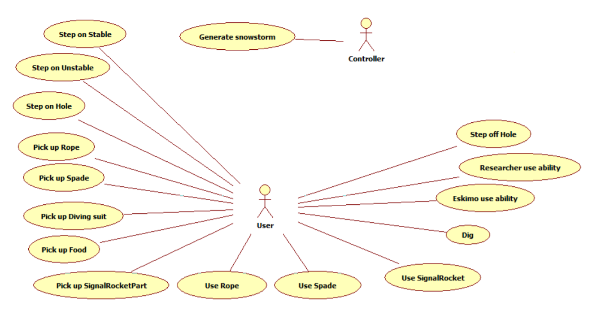

# BDD tesztek készítése

## Elvégzett munka

- A Cucumber szoftver használatához szükséges függőségek beimportálása.
- BDD tesztek megtervezése és leimplementálása a szoftver viselkedésének ellenőrzésére. Ehhez a projekthez tartozó usecase diagramot vettem alapul, hogy a felhasználó szempontjából lényges viselkedésket vizsgáljam meg:

### Eskimo lépésenek lemodellezése

|                Teszt neve                    |                  Leírás                    |
| -------------------------------------------- | ------------------------------------------ |
| Eskimo step on a Stable field                | Az eszkimó egy szomszédos üres jégtáblára lépésének lemodellezése. Ellenőrizzük, hogy sikeressen megtörtént-e a lépés és az eszkimó munka egysége is eggyel csökkent. |
| Eskimo step on an Hole field                 | Az eszkimó egy szomszédos Hole típusú táblára lép, aminek hatására a játékos a vízbe esik és eggyel csökken a munkaegysége is. |
| Eskimo step on an Unstable field which break | Az eszkimó egy szomszédos Unstable típusú mezőre lép, amin már áll egy karakter és a két karakter súlya alatt betörik a jégtábla, így mindeketten a vízbe esnek. |

### Az eszkimó és a sarkkutató képességének ellenőrzése

|                Teszt neve                    |                  Leírás                    |
| -------------------------------------------- | ------------------------------------------ |
| Eskimo use ability                           | Az eszkimó egy Stable típusú jégtáblán áll és használja a képességét, melynek hatásaára egy iglu keletkezik a jégtáblán. Leelenőrizzük, hogy létrejött-e az iglu és az eszkimó munka egysége is csökkent eggyel. |
| Researcher use ability                       | A sarkkutató egy Stable típusú jégtáblán áll és használja a képességét a szomszédos jégtáblára, hogy megtudja annak a kapacitását. Leelenőrizzük, hogy a kapott kapacitás valóban egyenlő a szomszédos jégtábla kapacitásával, valamint, hogy a sarkkutató munka egysége is csökkent eggyel. |

### A karakter ásásának lemodellezése

|                Teszt neve                    |                  Leírás                    |
| -------------------------------------------- | ------------------------------------------ |
| Eskimo dig on an ice field                   | Az eszkimó egy Stable típusú jégtáblán áll, amin egy rétegnyi hó van. A karakter végrehajt egy ásási műveletet, ennek hatására eltünik a hó a jégtábláról és az eszkimó munka egysége is csökken eggyel. |

### A játékban lévő tárgyak egy részénél a felvétel és használat ellenőrzése

|                Teszt neve                    |                  Leírás                    |
| -------------------------------------------- | ------------------------------------------ |
| Eskimo pick up a diving suit                 | Az eszkimó egy Stable típusú jégtáblán áll, és végrehajt egy ásási műveletet, aminek hatására egy DivingSuite típusú tárgyat talál, amit egyből felvesz. Leelenőrizzük, hogy a karakter felvette a búvárruhát és a munka egysége is csökkent eggyel. |
| Eskimo pick up a spade and use it            | Az eszkimó egy Stable típusú jégtáblán áll, és végrehajt egy ásási műveletet, aminek hatására egy Spade típusú tárgyat talál, amit egyből felvesz. Ezután átlép egy szomszédos mezőre, amin 2 rétegnyi hó van és használja az előbb felvett tárgyat, aminek hatására a hó eltünik a mezőről. Leellenőrizzük, hogy a hó eltünt-e a jégtábláról, valamint, hogy a karakter munkaegysége csökkent-e 3-mal. |
| Eskimo pick up a food                        | Az eszkimó egy Stable típusú jégtáblán áll, és végrehajt egy ásási műveletet, aminek hatására egy Food típusú tárgyat talál, amit egyből felvesz. Ennek hatására a karakter testhője eggyel nő és a munka egysége eggyel csökken. |
| Eskimo pick up a tent and use it             | Az eszkimó egy Stable típusú jégtáblán áll, és végrehajt egy ásási műveletet, aminek hatására egy Tent típusú tárgyat talál, amit egyből felvesz. Ennek hatására a jégtáblán létrejön egy sátor és a karakter munkaegysége kettővel csökken. |

## Összefoglalás és tanúlság

A BDD lényege, hogy az adott szoftver viselkedését veszi alapul, ezt használja fel tesztek, illetve az implementáció elkészítéséhez, ami azért jó, mert a viselkedés nagyon közel áll az üzleti követelményekhez, azaz jobban kiszolgálja a megrendelő elvárásait. A Cucumber segítségével egyszerű, kifejező és jól olvasható módon tudunk tesztesteket megfogalmazni.